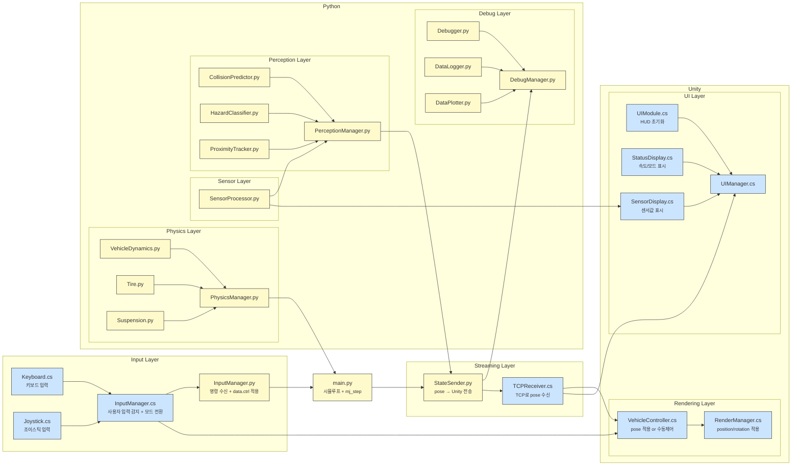

```mermaid
graph LR

main[main.py<br><small>시뮬루프 + mj_step</small>]

%% === Input Layer ===
subgraph Input Layer
	keyboard[Keyboard.cs<br><small>키보드 입력</small>]
	joystick[Joystick.cs<br><small>조이스틱 입력</small>]
	CS_Input[InputManager.cs<br><small>사용자 입력 감지 + 모드 전환</small>]
	PY_Input[InputManager.py<br><small>명령 수신 + data.ctrl 적용</small>]
end

keyboard --> CS_Input
joystick --> CS_Input

%% Python Part 
subgraph Python
	%% === Physics Layer ===
	subgraph Physics Layer
		vehicle[VehicleDynamics.py]
		tire[Tire.py]
		suspension[Suspension.py]
		physics_manager[PhysicsManager.py]
	end
	
	vehicle --> physics_manager
	tire --> physics_manager
	suspension --> physics_manager
	
	%% === Sensor Layer ===
	subgraph Sensor Layer 
		sensor[SensorProcessor.py]
	end
	
	%% ==== Perception Layer ====
	subgraph Perception Layer
	    perception[PerceptionManager.py]
	    collision[CollisionPredictor.py]
	    hazard[HazardClassifier.py]
	    prox[ProximityTracker.py]
	end
	
	%% === Debug Layer ===
	subgraph Debug["Debug Layer"]
		debug_manager[DebugManager.py]
		debugger[Debugger.py]
		logger[DataLogger.py]
		plotter[DataPlotter.py]
	end
end 

%% === Streaming Layer ===
subgraph Streaming Layer
	state_sender[StateSender.py<br><small>pose → Unity 전송</small>]
	unity_recv[TCPReceiver.cs<br><small>TCP로 pose 수신</small>]
end


%% Unity Part 
subgraph Unity
	%% === Rendering Layer ===
	subgraph Rendering Layer
		veh_ctrl[VehicleController.cs<br><small>pose 적용 or 수동제어</small>]
		renderer[RenderManager.cs<br><small>position/rotation 적용</small>]
	end
	
	%% === UI Layer ===
	subgraph UI["UI Layer"]
		ui_manage[UIManager.cs]
		ui_mod[UIModule.cs<br><small>HUD 초기화</small>]
		status[StatusDisplay.cs<br><small>속도/모드 표시</small>]
		sensor_disp[SensorDisplay.cs<br><small>센서값 표시</small>]
	end
end

%% === Connect ===
CS_Input --> PY_Input
PY_Input --> main
physics_manager --> main
main --> state_sender

debugger --> debug_manager
logger --> debug_manager
plotter --> debug_manager
state_sender --> debug_manager

state_sender --> unity_recv
unity_recv --> veh_ctrl
CS_Input -->veh_ctrl
veh_ctrl -->renderer
unity_recv --> ui_manage
ui_mod --> ui_manage
status --> ui_manage
sensor_disp --> ui_manage

sensor --> perception
collision --> perception
hazard --> perception
prox --> perception
perception --> state_sender

sensor --> sensor_disp

%% === Color (Python - 노랑 / C# - 파랑) ===
style main fill:#fffacc,stroke:#333
style vehicle fill:#fffacc,stroke:#333
style tire fill:#fffacc,stroke:#333
style suspension fill:#fffacc,stroke:#333
style physics_manager fill:#fffacc,stroke:#333
style sensor fill:#fffacc,stroke:#333
style state_sender fill:#fffacc,stroke:#333
style perception fill:#fffacc,stroke:#333
style collision fill:#fffacc,stroke:#333
style hazard fill:#fffacc,stroke:#333
style prox fill:#fffacc,stroke:#333
style debugger fill:#fffacc,stroke:#333
style logger fill:#fffacc,stroke:#333
style plotter fill:#fffacc,stroke:#333
style debug_manager fill:#fffacc,stroke:#333

style PY_Input fill:#fffacc,stroke:#333
style CS_Input fill:#cce5ff,stroke:#333
style keyboard fill:#cce5ff,stroke:#333
style joystick fill:#cce5ff,stroke:#333
style unity_recv fill:#cce5ff,stroke:#333
style veh_ctrl fill:#cce5ff,stroke:#333
style renderer fill:#cce5ff,stroke:#333
style ui_manage fill:#cce5ff,stroke:#333
style ui_mod fill:#cce5ff,stroke:#333
style status fill:#cce5ff,stroke:#333
style sensor_disp fill:#cce5ff,stroke:#333
```